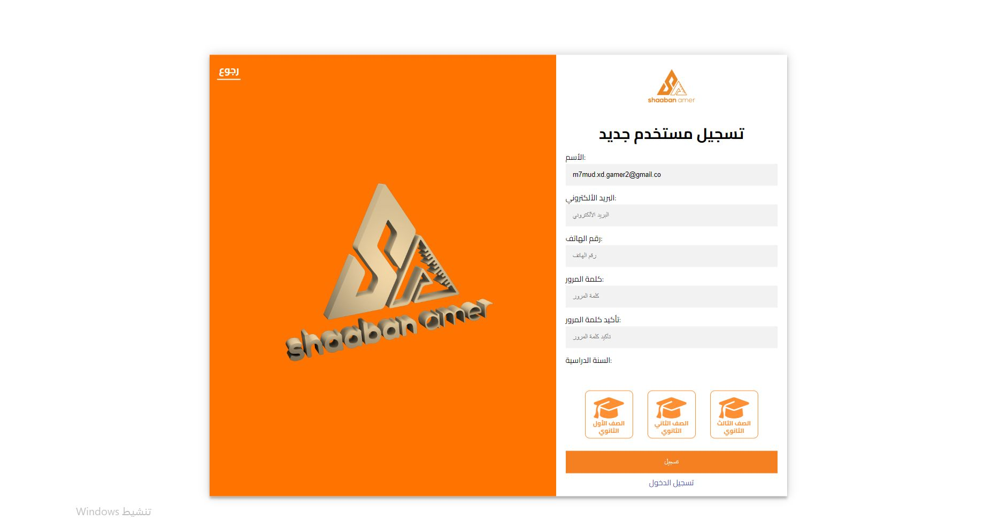

# AmerAcademy

AmerAcademy is an online platform for math courses designed to serve students and teachers with a seamless and interactive educational experience. The platform enhances learning efficiency by providing secure video streaming, user authentication, and a robust course management system.

---

## 🌟 Features
- **User Authentication & Authorization**: Secure access using JWT for students and teachers.
- **Course Management**: Teachers can create, update, and manage courses.
- **Exam System**: Students can take exams online and track their progress.
- **Secure Video Streaming**: Protects course content and ensures a smooth user experience.
- **Dashboard**: Teachers have a dedicated dashboard to manage their operations.
- **Scalability & Stability**: Deployed on a Linux server for optimal performance.

---

## 🛠️ Technologies Used
- **Frontend**: HTML, CSS, JavaScript, React.js
- **Backend**: Node.js, Express.js
- **Database**: MongoDB
- **Authentication**: JSON Web Tokens (JWT)
- **Deployment**: Linux server

---

## 🚀 Installation and Setup

### Prerequisites
- Node.js and npm installed
- MongoDB installed or access to a MongoDB Atlas cluster

### Steps
1. Clone the repository:
   ```bash
   git clone https://github.com/mmud/amer-academy-system.git
   ```

2. Set up the **Frontend**:
   - Navigate to the frontend folder:
     ```bash
     cd amer-academy-system/frontend
     ```
   - Install dependencies:
     ```bash
     npm install
     ```
   - Start the frontend server:
     ```bash
     npm start
     ```

3. Set up the **Backend**:
   - Open a new terminal and navigate to the backend folder:
     ```bash
     cd amer-academy-system/backend
     ```
   - Install dependencies:
     ```bash
     npm install
     ```
   - Set up environment variables:
     - Create a `.env` file in the backend directory.
     - Add the following variables:
       ```
       MONGO_URI=your_mongodb_connection_string
       JWT_SECRET=your_jwt_secret
       ```
   - Start the backend server:
     ```bash
     npm start
     ```

4. Access the platform in your browser at `http://localhost:3000`.

---

## 🖥️ Screenshots

### Home page


### Register


### Wallet


### Courses Page


### Exam


### Dashboard


---

## 📈 Achievements
- Served **1000+ students**, boosting platform profits by 20%.
- Successfully deployed on a Linux server for enhanced stability and scalability.

---

## 📄 License
This project is licensed under the MIT License. See the [LICENSE](LICENSE) file for details.
